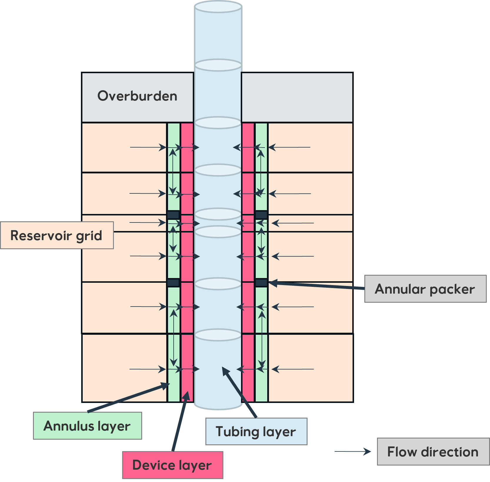

# Welcome to Completor® documentation

Completor® is developed to assist engineers in evaluation of Inflow Control Technology.

## What does Completor® do?

Completor® is a Python-3 based script internally developed by Equinor team
to solve the challenge of modeling and evaluating the use of Inflow Control Technology.
Completor® reads schedule file with multi-segment well (MSW) well model and user-defined completion configuration.
Completor® will output a new schedule file with new segmentations specifying tubing, device, and annulus layers.

## How to use Completor®?

In this documentation, you will find detailed instructions on how to install and setup Completor® [setup](./about/setup.mdx)
and some [examples](./about/examples.mdx).  